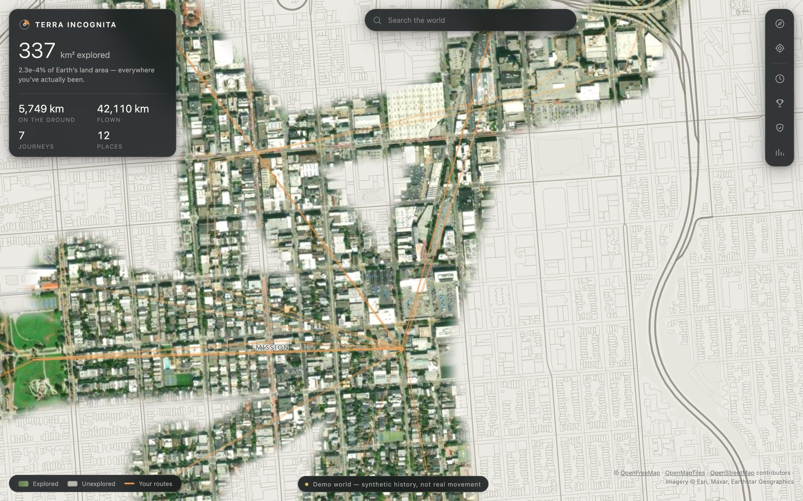

# Terra Incognita

A personal world map built from real movement. Territory you have physically
visited is revealed as vivid satellite ground; everywhere else stays a pale
cartographic survey — drawn, but not yet experienced.

> **The world is here, but I have only revealed the parts I have actually experienced.**



## Running it

```bash
pnpm install
pnpm exec playwright install chromium   # only needed for the verification loop
pnpm dev                                # http://localhost:5273
```

No API keys. Map data comes from [OpenFreeMap](https://openfreemap.org) and
imagery from Esri World Imagery, both keyless.

| Command | What it does |
| --- | --- |
| `pnpm dev` | Run the app in development |
| `pnpm build` | Production build into `dist/` |
| `pnpm serve` | Serve the production build on the local network |
| `pnpm test` | Unit tests (83) |
| `pnpm typecheck` | TypeScript, strict |
| `pnpm verify` | Screenshot every major view, scrape the console for errors |
| `pnpm perf` | Measure frame intervals and heap growth |

The dev port is pinned to 5273 so the verification harness always knows where to
look. If it reports the port is in use, a previous run is still alive:
`lsof -ti :5273 | xargs kill`.

## Testing real GPS on a phone

Browsers only expose geolocation in a **secure context**. `localhost` qualifies,
so tracking works on the development machine over plain HTTP — but a phone
reaches the app by LAN IP, which does not, and GPS is unavailable there.

Generating a local certificate turns on HTTPS and fixes that:

```bash
mkdir -p .certs
LAN_IP=$(ipconfig getifaddr en0)   # macOS; use `hostname -I` on Linux
openssl req -x509 -newkey rsa:2048 -nodes \
  -keyout .certs/dev-key.pem -out .certs/dev-cert.pem -days 365 \
  -subj "/CN=terra-incognita-local" \
  -addext "subjectAltName=DNS:localhost,IP:127.0.0.1,IP:${LAN_IP}"

pnpm build && pnpm serve
```

Vite picks the certificate up automatically when `.certs/` exists, and serves
`https://<your-lan-ip>:4173/`. The certificate is self-signed, so the phone warns
once — accepting it is what makes the origin secure, which is the entire point.

`.certs/` is git-ignored. Re-run the command if your LAN IP changes, since the
address is baked into the certificate.

To confirm an environment is actually GPS-capable:

```bash
node tests/verify/prodcheck.mjs https://<your-lan-ip>:4173/
```

It reports `secure context: true` when geolocation will work, and fails on any
console error.

`pnpm verify` writes to `artifacts/screenshots/` and exits non-zero on any
console error, page exception or render failure. Individual views can be run by
name: `pnpm verify statistics search`.

## What it does

- **Fog of war** — a WebGL mask erases a survey-map layer to reveal satellite
  imagery exactly where you have been, with a soft, organic boundary.
- **Live tracking** — real permission-gated GPS, with every failure mode
  surfaced by name rather than as a silent stall.
- **Journeys** — 453 days of history, browsable, with journey replay that runs
  on real elapsed time so a stop in a trip visibly pauses.
- **Statistics** — distance, streaks, active days, monthly rhythm.
- **Exploration score** — 13 achievements and a level system that tells you what
  to do next.
- **Search** — the user's own places plus a world gazetteer, with each result
  labelled explored / partly explored / unexplored.
- **Privacy** — top-level controls: home masking, lossless export, real deletion.

## Demo data

The app ships with a deterministic 18-month synthetic history for a fictional
person in San Francisco: ~131,000 GPS fixes, 1,151 movements, four road trips and
three long-haul flights.

**It is not real location data**, it is labelled `source: 'demo'` on every record,
and the UI carries a permanent demo badge. Regenerating with the same seed
produces byte-identical history, which is what makes screenshots comparable
between runs.

## Documentation

- [`ARCHITECTURE.md`](ARCHITECTURE.md) — conventions, the data-integrity model,
  how the fog renderer works and the constraints that keep it working.
- [`docs/STATUS.json`](docs/STATUS.json) — per-module state, measurements, and
  the open issues, including what is **not** done.

## Known limitations

These are real and deliberately not hidden:

- **No persistence.** History lives in memory; export works, but live-tracked
  fixes do not survive a reload.
- **The 60 FPS budget is unverified.** The headless harness renders through
  SwiftShader with no GPU, so it can catch regressions but cannot confirm the
  budget. Heap stability *is* verified: zero growth across two identical
  interaction passes.
- **Country attribution is inferred** from proximity to known cities, not from
  border geometry. It under-counts rather than inventing visits, and the UI says
  so where it is shown.
- **No discovery animation yet** for newly revealed territory.

## Attribution

Map data © [OpenFreeMap](https://openfreemap.org) ·
[OpenMapTiles](https://www.openmaptiles.org/) ·
[OpenStreetMap](https://www.openstreetmap.org/copyright) contributors.
Imagery © Esri, Maxar, Earthstar Geographics. Both attributions are required and
are surfaced in the app.
